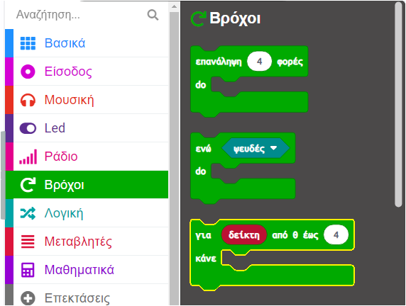

Όταν προσθέτεις ένα μπλοκ `για`{:class='microbitloops'} `δείκτη`{:class='microbitvariables'} στον χώρο εργασίας σου, δημιουργείται αυτόματα η μεταβλητή `δείκτης`{:class='microbitvariables'}.

Η μεταβλητή `δείκτης`{:class='microbitvariables'} παίρνει κάθε τιμή από το «0» μέχρι τον τελικό αριθμό και αυξάνει κατά ένα κάθε φορά.

Χρησιμοποίησες αυτόν τον βρόχο στο έργο Παρακολούθησης ύπνου για να δημιουργήσεις ένα χρονόμετρο.

Μετονόμασες τη μεταβλητή `δείκτης`{:class='microbitvariables'} σε `δευτερόλεπτο`{:class='microbitvariables'}, επειδή το χρονόμετρο αυξανόταν κάθε δευτερόλεπτο.

**Συμβουλή:** 💡 Είναι καλό να δώσες σε μια μεταβλητή ένα όνομα που να έχει νόημα, ώστε να μπορείς να την βρίσκεις εύκολα στον κώδικά σου αργότερα.

```microbit
function timer () {
    for (let second = 0; second <= 2; second++) {
        basic.showNumber(second + 1)
        basic.pause(1000)
    }
}
```

- Μπορείς να βρεις το μπλοκ `για`{:class='microbitloops'} `δείκτη`{:class='microbitvariables'} στο μενού `Βρόχοι`{:class='microbitloops'} στην Εργαλειοθήκη σου.


