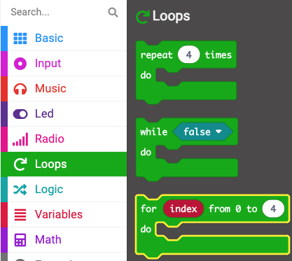

When you add a `for `{:class='microbitloops'}`index`{:class='microbitvariables'} block to your Workspace, the `index`{:class='microbitvariables'} variable is created.

The `index`{:class='microbitvariables'} variable takes on each value from `0` to the end number and counts up by one each time.

You used this loop in the Sleep tracker project to create a timer.

You renamed the `index`{:class='microbitvariables'} variable to `second`{:class='microbitvariables'}, because your timer increased each second.

**Tip:** 💡 It is good to give a variable a meaningful name so you can later find it easily in your code.

```microbit
function timer () {
    for (let second = 0; second <= 2; second++) {
        basic.showNumber(second + 1)
        basic.pause(1000)
    }
}
```

- You can find the `for `{:class='microbitloops'}`index`{:class='microbitvariables'} block in the `Loops`{:class='microbitloops'} menu in your Toolbox.

