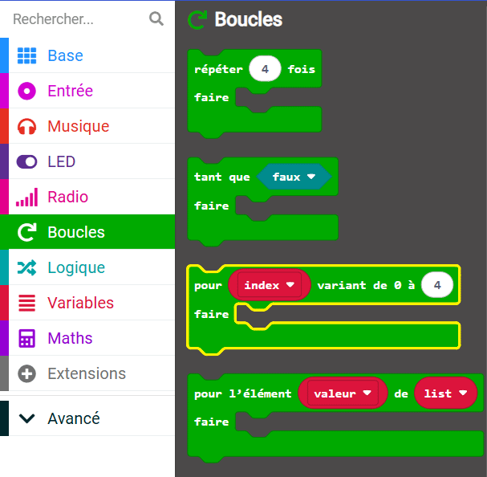

Lorsque tu ajoutes un bloc `pour`{:class='microbitloops'} `index`{:class='microbitvariables'} à ton espace de travail, la variable `index`{:class='microbitvariables'} est automatiquement créée.

La variable `index`{:class='microbitvariables'} prend sur chaque valeur de `0` au nombre final et compte un à chaque fois.

Tu as utilisé cette boucle dans le projet Suivi du sommeil pour créer un minuteur.

Tu as renommé la variable `index`{:class='microbitvariables'} en `seconde`{:class='microbitvariables'}, car ton minuteur augmentait à chaque seconde.

**Astuce :** 💡il est de bonne pratique de donner à une variable un nom significatif pour que tu puisses le trouver facilement dans ton code plus tard.

```microbit
function minuteur () {
    for (let seconde = 0; seconde <= 2; seconde++) {
        basic.showNumber(seconde + 1)
        basic.pause(1000)
    }
}
```

- Tu peux trouver le bloc `pour`{:class='microbitloops'} `index`{:class='microbitvariables'} dans le menu `Boucles`{:class='microbitloops'} dans ta boîte à outils.


