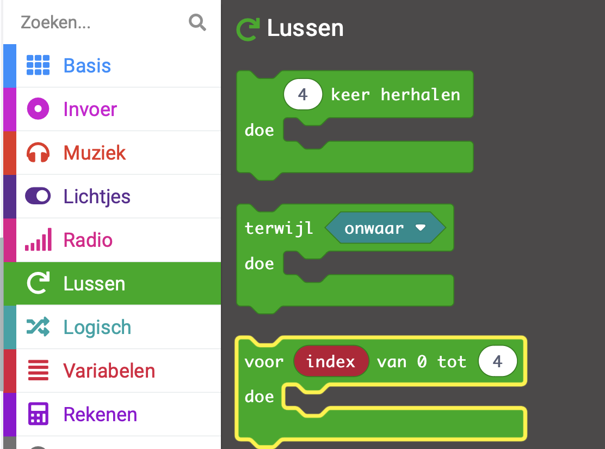

Wanneer je een `voor`{:class='microbitloops'} `index`{:class='microbitvariables'} blok aan je bewerkingspaneel toevoegt, wordt de `index`{:class='microbitvariables'} variabele automatisch aangemaakt.

De variabele `index`{:class='microbitvariables'} neemt elke waarde aan van '0' tot het eindgetal en telt elke keer met één op.

Je hebt deze lus gebruikt in het Slaap-monitor project om een timer te maken.

Je hebt de `index`{:class='microbitvariables'} variabele hernoemd naar `seconde`{:class='microbitvariables'}, omdat je timer elke seconde steeg.

**Tip:** 💡 Het is goed om een variabele een logische naam te geven, zodat je deze later gemakkelijk in je code kunt terugvinden.

```microbit
function timer () {
    for (let second = 0; second <= 2; second++) {
        basic.showNumber(second + 1)
        basic.pause(1000)
    }
}
```

- Je kunt het blok `voor`{:class='microbitloops'} `index`{:class='microbitvariables'} in het `Lussen`{:class='microbitloops'} blokmenu in je Toolbox vinden.


